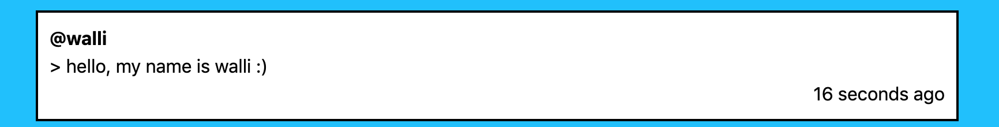

## What is React?

이번 포스트에서는 왜 React와 같은 프론드엔드 라이브러리를 사용해야하는지에 대해 알아보도록 하겠습니다.

우리가 웹 사이트를 만든다고 하면 다음과 같은 방법이 있습니다. html과 css를 이용해서 만드는 방법, 여기에 javascript를 적용해서 동적으로 뭔가 액션을 더 만들 수 도 있겠죠? 또다른 방법은 React, Vue와 같은 프론트엔드 라이브러리를 사용하는 방법이 있습니다.

요즘 웹페이지는 단순히 데이터만을 보여주는게 아니라 유저와 수많은 상호작용이 일어납니다. 이렇게 많은 상호작용이 가능하려면 수많은 상태 관리가 필요합니다.

예들들어 버튼 하나를 눌렀을 때를 생각해 봅시다. 우리는 다음과 같은 작업을 생각할 수 있습니다.

*1. 먼저 클릭할 DOM을 찾습니다.*

*2. 찾은 DOM에 우리가 하고자할 액션을 실행시킵니다.*

*3. 변경이된 DOM을 다시 화면에 뿌려줍니다.*

이렇게 하나의 버튼클릭액션에도 많은 상태를 관리해야 합니다.

사실 사용자와의 상호작용이 별로 없다면 HTML,css만으로도 충분합니다. 하지만 상호작용이 늘어날수록 즉,  관리해야할 DOM이 많아질수록 이를 관리하는것은 정말 어려운 일입니다.

사람들은 이렇게 귀찮고 복잡한 DOM관리와 상태값 관리를 최소화 해주고, 오직 기능개발에만 집중할수 있는 방법을 고민했고, 이런 고민에 대한 해결책으로 지금의 프론트엔드 라이브러리또는 프레임웍이 만들어졌습니다. 대표적으로 React, Vue, Angular와 같은 라이브러리가 있습니다.


## Component

React는 컴포넌트라는 개념에 집중하고 있는 프론트엔드 라이브러리인데요, 컴포넌트는 쉽게 말해 나만의 html tag라고 생각할 수 있습니다.

예를 들어, 아래 그림과 같이 트위터의 한 트윗을 표시하기 위해서는 다음과 같이 html tag를 구현해야 합니다.



```html
<div class="tweet">
	<span class="userId" > @walli </span>
	<div class="contants"> hello, my name is walli :)</div>
	<div class="time"> 16 seconds ago </div>
</div>
```

이것을 아래와 같이 쓴다면 어떨까요?

```jsx
<Tweet userId="walli" time="16 secondes ago" >
	hello, my name is walli :)
</Tweet>
```

Tweet 이라는 태그는 원래 없습니다. 하지만 이렇게 하나의 의미를 가진 태그를 만들어 사용할 수 있다면 코드가 직관적이고, 재사용성도 높아지겠죠? 이게 바로 컴포넌트 입니다.

리액트에서는 이 컴포넌트 단위로 개발을 진행합니다.
