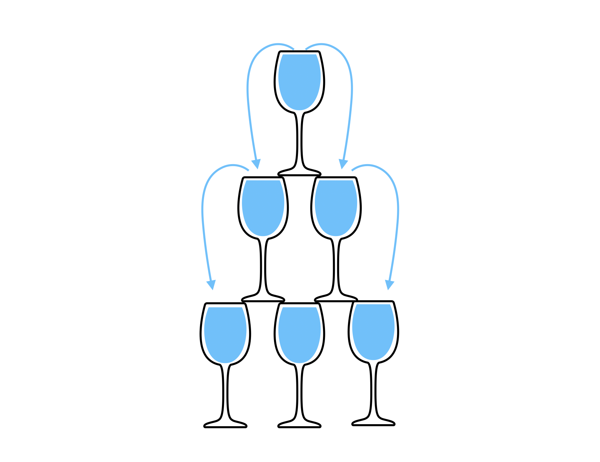
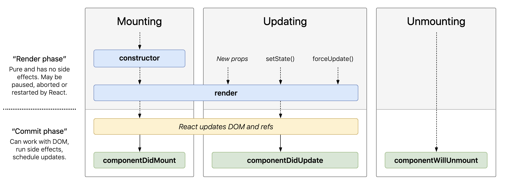

# React Data Flow

위 그림은 컵에 물을 부으면 물이 아래 컵으로 흐르는 그림입니다. 이 그림은 리액트의 데이터 흐름을 잘 표현해주는 그림입니다. 리액트는 **단방향 데이터 흐름**을 가지고 있습니다. 즉 데이터가 한 방향으로만 이동합니다. 그림에서 보듯이 아래로 흐른 물이 거꾸로 올라갈 수는 없습니다.




코드로 살펴보면 다음과 같이 될 것 같습니다. 리액트를 이용하여 작성하다보면 항상 부모 컴포넌트와 자식 컴포넌트가 존재하게 됩니다. 

```jsx
class Parent extends Component{
	render(){
		return(
			<Child />
		)
	}
}
```

리액트에서 데이터는 항상 상위 컴포넌트에서 하위 컴포넌트로만 흐름니다. 하위 컴포넌트에서 상위 컴포넌트로 데이터를 직접적으로 올려줄 순 없습니다.( 물론 간접적으로 데이터를 오려줄 순 있습니다. )

# Props

리액트의 중요 특징인 props 와 state라는 개념이 있습니다. 그 중 props에 대해 먼저 살펴보겠습니다. 위 그림에서 내려오는 물줄기를 props라고 생각할 수 있습니다.

**props는 자식컴포넌트가 부모 컴포넌트로부터 받아오는 데이터 입니다.** 따라서 자식 컴포넌트에서는 이 props를 단순히 사용만 할 수 있고, 변경할 수는 없습니다. props를 내려줄때는 다음과 같이 내려줍니다.

```jsx
function Parent(){
	return(
		<Child name="walli" />
	)
}
```

이처럼 태그안에 속성을 주는것처럼 넘겨줄 수 있습니다. 여기서는 name이라는 props를 내려줍니다.
여러개를 더 내려줄수도 있습니다. 이렇게요.

```jsx
function Parent(){
	return(
		<Child name="walli" age="10" />
	)
}
```

받아온 props를 사용할 때는 다음과 같이 사용합니다.

```jsx
function Child(props){
	return(
		<h1> hello, {props.name} </h1>
	)	
}
```

 이때 부모 컴포넌트에서 넘겨줄때 지정한 이름이 props의 이름입니다.

# state

다음은 State에대해 살펴보겠습니다. 위 그림에서 state는 컵 안에 들어있는 물 이라고 생각할 수 있습니다.

**state는 컴포넌트가 갖는 상태 입니다.** 객체의 형태로 컴포넌트 내에서 보관하고 관리합니다. state를 사용하기 위해서는 class 컴포넌트로 작성되어야 합니다. 아래와 같이 state를 정의할 수 있습니다.

```jsx
class Person extends Component{
	state = {
		power: 50,
		isHungry: false
	}

	render(){
		return(
			...JSX code...
		)
	}
}
```

state 값을 변경하고 싶을때는 단순히 변경하면 안됩니다. **반드시 setState라는 메서드를 사용하여 변경**해야 합니다. 아래 보이시는 코드처럼 setState를 이용하여 state 값을 변경 할 수 있습니다.

```jsx
class Person extends Component{
	state = {
		power: 50,
		isHungry: false
	}

// state를 이렇게 직접 변경하면 안됩니다!
  changeState(){
    this.state.power = 100;
  }

	render(){
		return(
			...JSX code...
		)
	}
}

//////////////////////////////////////////////////////////////////////////////////////

class Person extends Component{
	state = {
		power: 50,
		isHungry: false
	}

// 다음과 같이 반드시 setState 메서드를 이용해야 합니다.
  changeState(){
    this.setState({
      power : 100
    })
  }

	render(){
		return(
			...JSX code...
		)
	}
}
```

이처럼 컴포넌트의 상태를 보관 관리할 수 있습니다.

여기서 한가지 더 기억하셔야 할 부분은 **state값이 변경되면 render함수가 다시 호출됩니다.**

# Life Cycle

라이프사이클은 컴포넌트가 생성 업데이트 삭제 될때 일어나는 과정으로, 각 과정 전 후로 특정 메서드가 실행됩니다. 우리는 이렇게 실행되는 메서드를 적절히 이용할 수 있습니다.

다음 그림은 리액트 공식 홈페이지에서 제공하는 라이프사이클 그래프입니다.




#### 1. 컴포넌트 생성

컴포넌트가생성, 즉작성된 컴포넌트가 호출되면 먼저 생성자가 불립니다.그리고 컴포넌트내의 렌더 메서드가 실행 됩니다. 이때 JSX를 반환하여 화면에 그려지는 작업이 일어나겠죠? 이렇게 렌더가 끝나면 componentDidMount라는 메서드가 불립니다.

#### 2. 컴포넌트 업데이트

컴포넌트가 업데이트된다는 것은 state의값이 변경됬을 때 일어납니다. state가 변경 되면 render함수가 실행 됩니다. 그리고 업데이트된 값이 화면에 보여지고 이렇게 화면 렌더링까지 끝나면 componentDidUpdate메서드가 실행 됩니다.

.

이렇게 컴포넌트에 어떤 이벤트가 발생 하면 항상 라이프 사이클 메서드가 실행 됩니다. 우리는 이 메서드를 적절히 이용하여 원하는 타이밍에 원하는 작업을 수행할 수 있습니다. 라이프사이클 메서드를 사용하시기 위해서는 컴포넌트를 class 컴포넌트로 작성하셔야 합니다. 함수형 컴포넌트에서는 라이프사이클 메서드가 실행되지 않습니다.