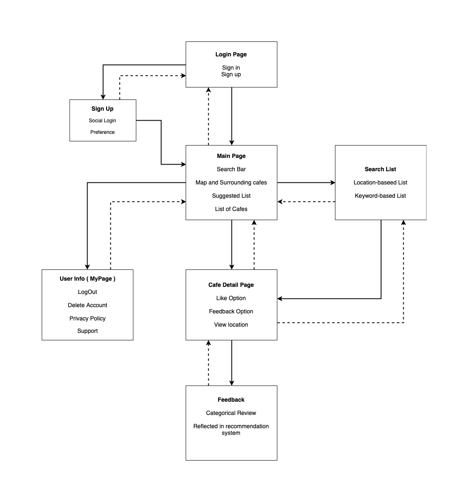
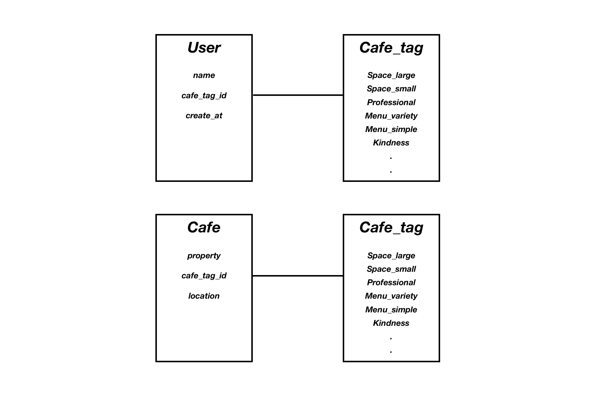
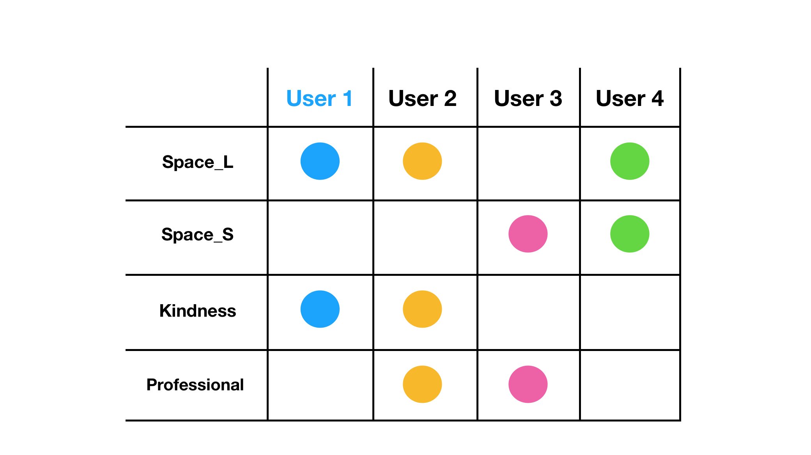

## Client flow

---

전체적인 클라이언트 플로우는 다음와 같이 구성하였다.

## Component Design

---

각각의 컴포넌트를 작성할 때 ios와 android 두 플랫폼 환경을 지원할 수 있도록 작성해야 했다. React Native의 장점중 하나가 하나의 javascript 코드를 이용하여 두 플랫폼으로 동시에 빌드할 수 있는 것인데, 모든 패키지가 두 플랫폼을 모두 지원하는 것이 아니라서 코드를 분기하여 처리해주어야 했다.

- ios와 android의 View가 다르게 보이는 이슈가있다. 예를 들면 ios의 header title의 기본 위치는 가운데 정렬 인데, android의 header title의 기본위치는 왼쪽 정렬이다.

- 제스처의 기본값도 두 환경이 다르다. ios의 경우 swip back 제스처의 기본값이 True 이지만, android의 경우 기본적으로 back 버튼이 존재하기 때문에 swip back 제스처의 기본값은 Flase이다.

사실 기능적인 구현보다, ios 사용자와 android사용자의 익숙한 UX가 다르기 때문에 이에대한 고민이 가장 컸다.

## Collaborative Filtering ( recomender system)

---

이번 서비스에서 가장 핵심이 되는 기능중에 하나가 바로 이 CF( Collaborative Filtering )을 이용한 추천 시스템이다. 짧은 프로젝트 기간이었지만, 단순히 데이터를 보여주는것 보다 좀더 의미있는 데이터로 가공해서 사용자에게 보여주고 싶은 마음이 컷다. 추천 시스템은 이젠 거의 모든 서비스의 기본이 된다고 해도 과언이 아닐만큼 중요한 부분으로 자리하고 있다.

기본적인 기계학습과 데이터간 유사도 측정에대한 부분을 빠르게 학습하여 가장 최적이라 생각하는 라이브러리를 선택하여 추천시스템을 적용시켰다. 라이브러리를 사용하여 구현하긴하지만 기본적인 User-base CF 모델을 디자인하는것은 직접해야 했다.

- 카페의 특성을 나타내는 table이 있다. 이 테이블은 user 테이블, cafe 테이블과 1:1로 매칭된다. (하나의 카페특성 테이블이 매칭되는것이아니라 각각 개별적인 테이블로 매칭된다. )
- User는 각각의 카페에 대한 피드백을 카페 특성 태그를 이용하여 남긴다.
- User가 선택한 태그를 해당 유저가 중요하게 생각하는 요소로 판단하고 학습시킨다.
- 해당 cafe는 받은 피드백 태그가 그 카페의 특성을 나타낸다고 판단하고 학습키신다.
- 유저간의 유사도와 카페와 유저간의 유사도를 측정하여 해당 유저가 중요하게 생각하는 요소를 지닌 카페를 추천한다

### **Recommandation logic**

**1. User 1 과 가장 비슷한 태그를 선택한 유저를 찾는다. (유사도 측정)**

아래 그림에서 *User 1*을 기준으로 생각해보자. 먼저 *User 1*과 가장 비슷한 선택을 한 유저를 찾는다. *User 1*과 가장 비슷한 선택을 한 유저는 User 2이다.

**2. User 1 과 가장 비슷한 유저가 선택한 태그 중 _User 1_ 이 선택하지 않은 태그를 찾는다.**

_User 1_ 은 `Space_L` 과 `Kindness` 를 선택했고, *User 2*는 이 두가지와 추가로 `Professional`을 선택했다. 나는 선택하지 않았지만, 나와 비슷한 선택을 한 유저가 선택한 태그를 **추천 태그**로 지정한다.

**3. *User 1*가 선택한 태그에 추천 태그를 추가한다.**

*User 1*가 선택한 태그는 이제 `Space_L`, `Kindness`, `Professional` 이 된다.

**4. 추천받은 태그를 포함하여, 이번에는 *User 1*이 선택한 태그를 강점으로 가지고 있는 카페를 찾는다. (유사도 측정)**

*User 1*이 선택한 태그를 강점으로 가지고 있는 카페 중 태그가 가장 많이 일치하는 카페를 선택한다. 아래 그림에서는 Cafe 2가 가지고 있는 강점 태그가 *User 1*이 선택한 태그와 가장 유사도가 높다.

**5. *User 1*과 가장 유사도가 높은 카페를 추천카페로 지정한다.**

이렇게 추천시스템을 구현해 보았다. User-base CF를 두 번 중첩해서 사용함으로써 사용자 개개인이 중요하게 생각하는 카페를 추천해 줄 수 있었다. 이렇게 구현한 추천 시스템은 상당히 만족스러운 추천 결과를 얻을 수 있었지만 cold start 이슈가 있다. cold start란 서비스 초기에 학습된 데이터가 부족하여 추천 정확도가 떨어지는것을 말한다. 이런 cold start 이슈를 최소화 하기위해 사용자에게는 가입시 중요하게 생각하는 요소를 미리 입력 받거나, 카페의 기본값을 설정하여 이런 cold start 이슈를 줄일 수 있을것이라 생각한다.

추후에 다른 서비스에서는 어떻게 추천시스템을 구현하고 있는지를 좀 더 조사해보고, 기계학습과 데이터간 유사도 측정에대한 부분을 좀 더 깊게 이해한다면 지금보다 좀 더 정확도 높은 추천시스템을 구현할 수 있을것이라 기대한다.
